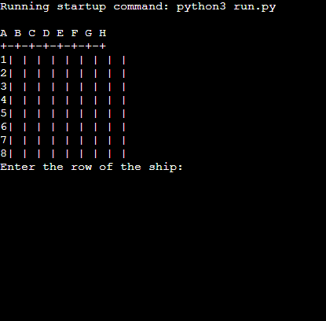
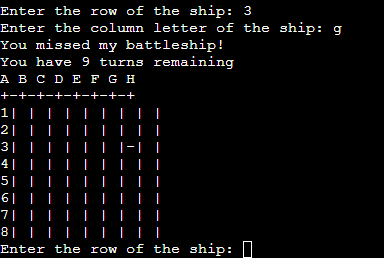
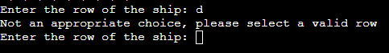
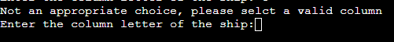
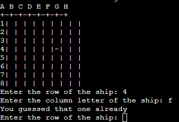

 <h1 align=center>Battleship</h1> 

 Battleship is a python based game which, is displayed in the Code institute mock terminal on Heroku

 The aim of the game is for the user to find and sink all of the computers battleships before you run out of turns. Each Battleship occupies a single space on the board. 

 [view my project here](https://marks-battleship-game.herokuapp.com/)

 <h2>

# How to play

this game is based on the original pencil and paper game Battleship. You can find more information about it on [wikipedia](https://en.wikipedia.org/wiki/Battleship_(game))

my version of the game, 5 ships are randomly placed on the board.

the user has a total of 10 trys to successfully sink the computers battelships.

a single board is generated on the terminal, the user cannot see where the ships are placed.

ships are marked by the 'x' sign but, the user won't be able to see them until he guesses right.

previous guessess are marked with the '-' sign.

If the user is unsuccessful the terminal will state that you 'missed' and inform you how many turns you have left.

if you run out of turns before finding all the computers ships, the game ends.

# Features 

- ## Existing Features
    - The computer's ships are randomly placed on the board
    - The user cannot see the computer's ships
    - numbers are used for rows 
    - and letters for columns so there is no confusion

<h2>

- ##### play against the computer
- ##### accepts row and column input 
- ##### keeps score of how many turns left

<h2>

- ##### you can't choose a number or letter beyond the board grid
- ##### you must pick a number for rows 
- ##### and a letter for colmuns

<h2>
<h2>

- ##### you can't input the same guess twice

<h2>