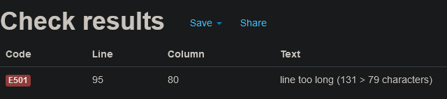

 <h1 align=center>Battleship</h1> 

 Battleship is a python based game which, is displayed in the Code institute mock terminal on Heroku

 The aim of the game is for the user to find and sink all of the computers battleships before you run out of turns. Each Battleship occupies a single space on the board. 

 [view my project here](https://marks-battleship-game.herokuapp.com/)

 <h2>

# How to play

this game is based on the original pencil and paper game Battleship. You can find more information about it on [wikipedia](https://en.wikipedia.org/wiki/Battleship_(game))

my version of the game, 5 ships are randomly placed on the board.

the user has a total of 10 trys to successfully sink the computers battelships.

a single board is generated on the terminal, the user cannot see where the ships are placed.

ships are marked by the 'x' sign but, the user won't be able to see them until he guesses right.

previous guessess are marked with the '-' sign.

If the user is unsuccessful the terminal will state that you 'missed' and inform you how many turns you have left.

if you run out of turns before finding all the computers ships, the game ends.

# Features 

- ## Existing Features
    - The computer's ships are randomly placed on the board
    - The user cannot see the computer's ships
    - numbers are used for rows 
    - and letters for columns so there is no confusion

<h2>

- ##### play against the computer
- ##### accepts row and column input 
- ##### keeps score of how many turns left

<h2>

- ##### you can't choose a number or letter beyond the board grid
- ##### you must pick a number for rows 
- ##### and a letter for colmuns

<h2>
<h2>

- ##### you can't input the same guess twice

<h2>

# Testing 
### I have manually tested the code with the following:
- i have passed my the code through PEP8 linter and confirmed there are no issues.
- tested on in gitpod terminal and Code institute mock terminal on Heroku
- I have given invalid inputs. i have put numbers when when i should input a letter, out of bounds and have put in the same input.

##  bugs

 ### solved bugs

- when writing the code for the project i was getting the error 'e501'. i solved it by indenting the code after the opening Parentheses.

## Remaining Bugs

-  One of the 'E501' errors remain. I currently have not figured out a way to indent this line of code without generating a syntax error. So far any attempt stops the code from whole game from working.

<h2>

# Deployment

This project was deployed using Code Institute's mock terminal on Heroku.

- how to deploy:
    - click 'create new app' in Heroku
    - Set choose buildbacks python and NodeJS in that order
    - choose GitHub as your deployment method then click connect
    - link your repository to Heroku by inputing your reopository name
    - click on Deploy

# Credits

- Credt goes to gbrough over on github for providing the code. link can be found [here](https://github.com/gbrough/battleship/blob/main/single_player_OO.py)
- Code Institute for the deployment terminal
